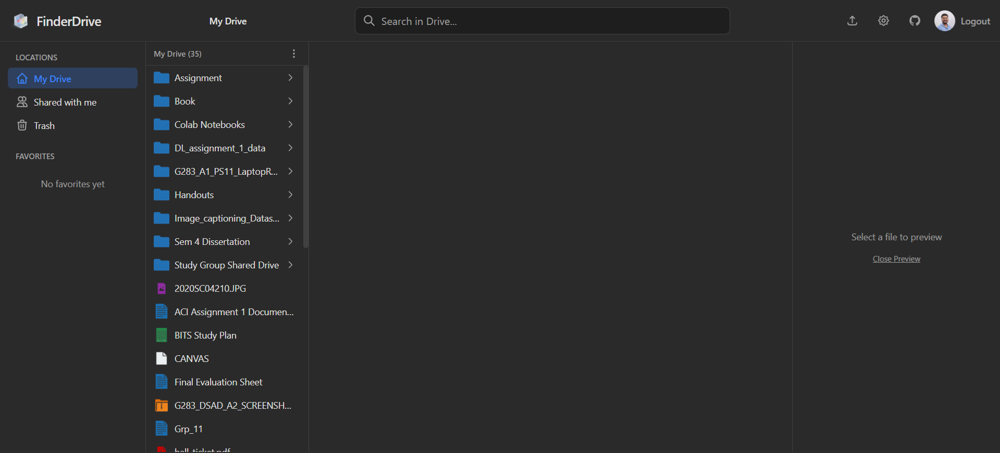
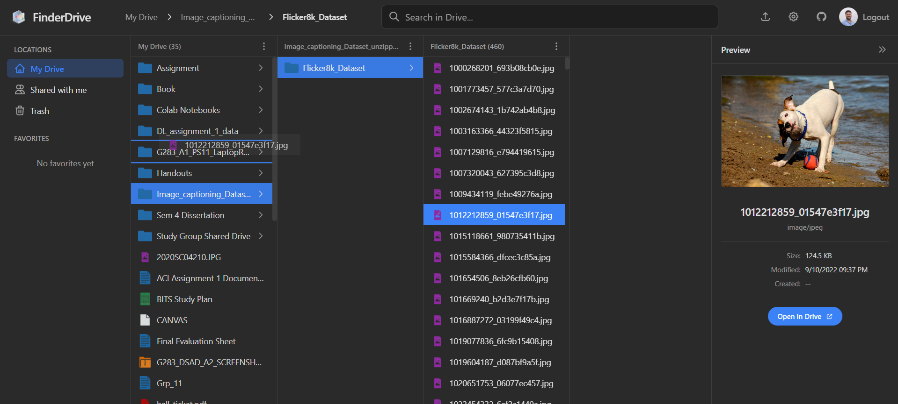
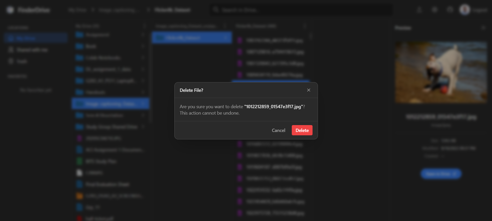
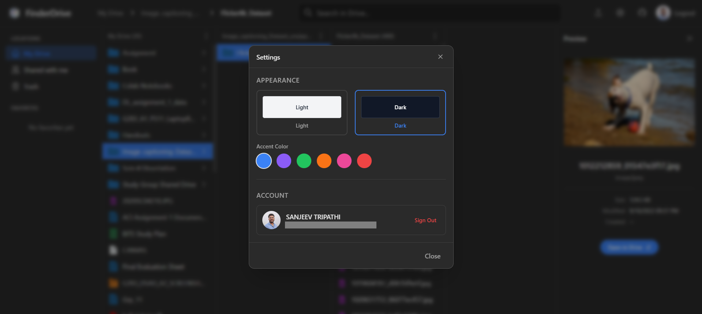

# FinderDrive

**macOS Finder-style Google Drive Client**

FinderDrive is an open-source, high-performance web client for Google Drive that faithfully replicates the intuitive **Column View** navigation of macOS Finder. Designed with a sleek glassmorphism aesthetic, it offers a fast, fluid, and beautiful way to browse and manage your cloud files.

## 📸 Screenshots

|  |  |
|:---:|:---:|
| **Classic Column View** | **Drag & Drop Uploads** |

|  |  |
|:---:|:---:|
| **Context Menus** | **Theme & Settings** |

## 🌟 Why You Need to Self-Host

You might be wondering, *"Why isn't there a live demo I can just log into?"*

**The Short Answer:** Google Security Protocols.

**The Details:** 
This application is designed to be fully functional, which requires the `https://www.googleapis.com/auth/drive` permission scope to manage your files. Google classifies this as a "Restricted Scope." For me to host this application publicly for everyone to use, Google requires a **Tier 3 CASA Security Assessment**, which costs between **$15,000 and $75,000 per year**. 

As an open-source developer, I can't foot that bill! 😅

**But here is the good news:** 
You can **host it yourself for free**! By creating your own personal Google Cloud project (which is free), you are the "developer" and the "user," so you can use the app without any security audits. It takes about 5 minutes to set up.

I encourage you to **Star ⭐ this repo**, **Clone 📋 it**, and **Run 🚀 it**!

## 🚀 How to Run It (In 5 Minutes)

### Prerequisites
*   Node.js (v18+)
*   A Google Account

### 1. Get the Code
```bash
git clone https://github.com/your-username/finderdrive.git
cd finderdrive
npm install
```

### 2. Get Your Credentials (The "Hard" Part)
1.  Go to the [Google Cloud Console](https://console.cloud.google.com/).
2.  Create a **New Project**.
3.  Search for **"Google Drive API"** and **Enable** it.
4.  Go to **Credentials** -> **Create Credentials** -> **OAuth Client ID**.
    *   **Application Type:** Single Page Application (or Web Application).
    *   **Authorized JavaScript origins:** `http://localhost:5173`
    *   **Authorized redirect URIs:** `http://localhost:5173`
5.  Copy your **Client ID**.

### 3. Configure & Run
Create a `.env` file in the project root:
```bash
cp .env.example .env
```
Paste your Client ID inside:
```env
VITE_GOOGLE_CLIENT_ID=your-client-id-here.apps.googleusercontent.com
```

Start the app:
```bash
npm run dev
```
Open `http://localhost:5173` and enjoy!

## 📦 Deployment (Optional)

Want to put it on the web for your own personal use? **Firebase Hosting** is perfect for this.

1.  **Install Firebase CLI**: `npm install -g firebase-tools`
2.  **Login**: `firebase login`
3.  **Init**: `firebase init hosting` (Choose your project, type `dist` as public dir, yes to SPA).
4.  **Build & Deploy**:
    ```bash
    npm run build
    firebase deploy
    ```
5.  **Final Step**: Don't forget to add your new firebase URL (e.g., `https://your-project.web.app`) to the **Authorized JavaScript origins** in your Google Cloud Console!

See the full [Deployment Guide](./deploy.md) for more details.

## 🤝 Contributing

Contributions are welcome! If you love the Mac aesthetic and React, feel free to fork and submit a PR. 

## 📄 License

MIT License. Built with ❤️ for the community.
